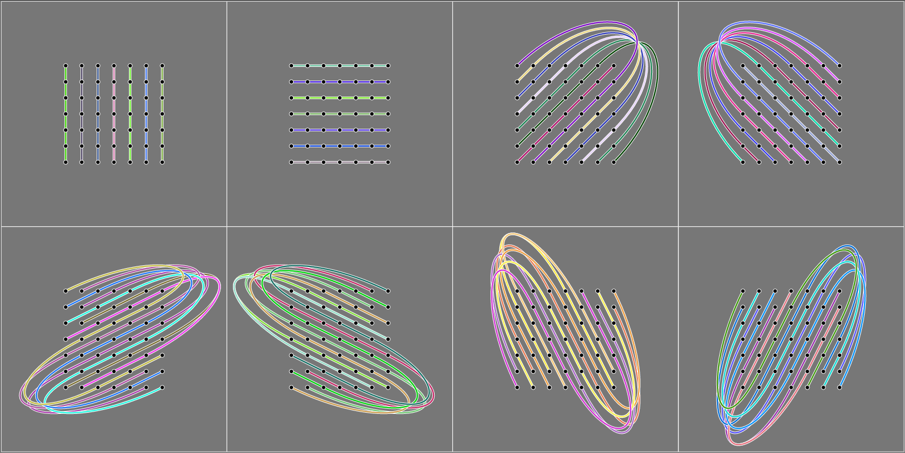
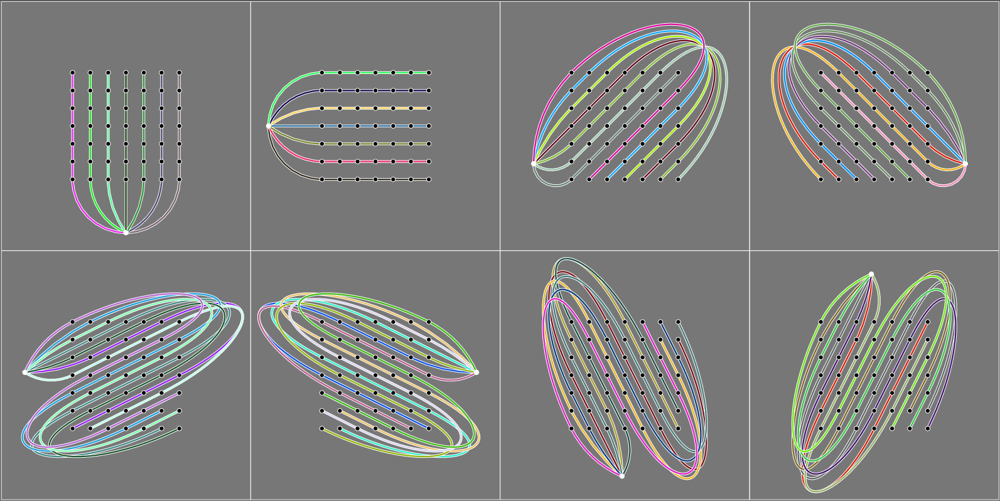

# Dobble and geometry

The card deck of a _perfect_ Dobble game (i.e. one with the maximal number of cards) is defined by the rules

1. Any two cards have exactly one symbol in common.
2. Any two symbols appear together on exactly one card.

It turns out that these requirements have an exact geometrical analogue. In two-dimensional affine geometry, the following two rules hold:

1. Any two non-parallel lines meet in exactly one point.
2. Any two points lie on (define) exactly one line. 

Since these characteristics depend only on the underlying vector-space, they particularly hold for vector-spaces over *finite fields* $\mathbb{F}_q$ with $q$ elements. So the strategy to construct a Dobble card game is as follows. Associate "card" with "line" and "symbol" with "point" and consider the affine plane $\mathbb{A}^2_q$ over the vector space $\mathbb{F}_q^2$. Next, construct every line in $\mathbb{A}^2_q$. Consider therefore that every line is defined by an equation
$$\mathbf{w}\cdot\mathbf{x} + b = 0\tag{1}$$
for some $\mathbf{w} \in \mathbb{F}_q^2$ and $b\in \mathbb{F}_q$. In other words, each line is defined by a tuple $(\mathbf{w}, b)$ where $\mathbf{w}$ ranges over all different "directions" of the vector space. It is easily verified that 

$$W := \left\lbrace (\bar 0,\bar 1)^T \right\rbrace \cup \left\lbrace (\bar 1, \bar 0)^T, (\bar 1, \bar 1)^T, (\bar 1, \bar 2)^T, \ldots, (\bar 1,\overline{q-1})^T \right\rbrace \subset \mathbb{F}_q^2$$

is a minimal and complete set representing all the directions in $\mathbb{A}_q ^2$ (i.e., the elements are pairwise linearly independent and any other vector is a multiple of one of these). 
With basic linear algebra one can show that the $(q+1) \cdot q$ tuples $(\mathbf{w}, b) \in W \times \mathbb{F}_q$ really define all the lines in 
$\mathbb{A}_q^2$ and that for every $(\mathbf{w}, b)$ there are exactly $q+1$ points satisfying equation (1). 

The following picture shows the eight groups of parallel lines in the affine plane $\mathbb{A}_7^2$. 
Note that each drawing direction actually matches one of the directions in $W$ if you regard them modulo 7. 

## Projective planes over finite fields 

Now, two different lines intersect in one point if they are _not parallel_, i.e. they have different norm vectors $\mathbf{w}$, 
whereas two lines with the same directions don't have a point in common in the affine plane. 
To make sure that also in the parallel case two lines share an equal point, we assign a new element 
$p_{\mathbf{w}} \not\in\mathbb{A}_q^2$, called a "point at infinity", to every line with direction $\mathbf{w}$. With this convention, any two lines have exactly one point in common, whether they share the same direction or not. Finally, we add another line containing all the "points at infinity". This guarantees that any two points lie on exactly one line.  (Technically, we are moving on to the _projective plane_ over $\mathbb{F}_q$, but for our purpose we can treat these infinity points and lines as simple _ad hoc_ postulations because at this point of the argument we don't need any algebraic structure of the point set anymore).

The picture shows the affine lines from the first picture plus the point at infinity.

This finishes the construction of the $\mathbb{F}_{q}$ Dobble card game. Substituting "card" with "line" and "point" with "symbol", we see that all the required properties for the Dobble desk are satisfied. Numberwise, the desk has the following properties:

* Every card contains $q+1$ symbols. (Every line contains $q$ normal points plus one "point at infinity".)
* There are $q^2 + q + 1$ different symbols. (The $q^2$ points in $\mathbb{A}_q^2$ plus $q+1$ "points at infinity".)
* There are $q^2 + q + 1$ different cards. (The $q^2 + q$ lines in $\mathbb{A}_q^2$ plus one "line at infinity".)

Note that the construction depends on the existence of a finite field with $q$ elements. Such a field exists if and only if $q$ is a prime power, i.e. $q=p^n$ for some prime number $p$ and natural exponent $n$. For $n=1$ this is just the residual ring $\mathbb{Z}/p\mathbb{Z}$ where the arithmetic is defined by calculating everything modulo $p$. But in general, for $n>1$, the field $\mathbb{F}_{p^n}$ is _not_ isomorphic to 
$\mathbb{Z}/p^n\mathbb{Z}$. The arithmetic in these general fields is somehow less obvious, and that's the reason we need a specialiced Python-library _Galois_ for that. 
